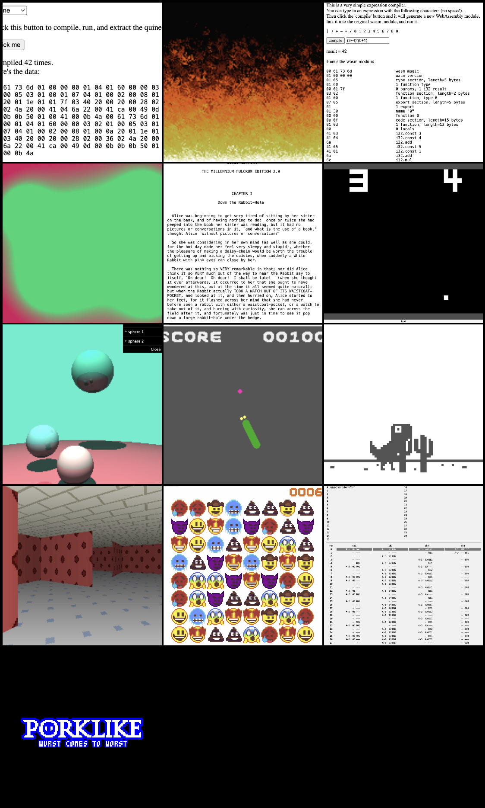

# Demo app

Demos: https://haribala.dev/wasm2js



Demos were taken from https://github.com/binji/raw-wasm and adapted to run with this library.

## Development

Install dependencies

```shell
$ pnpm install
```

Build the bundle and serve the static files

```shell
$ pnpm run full
```

Then go to http://127.0.0.1:8080/
